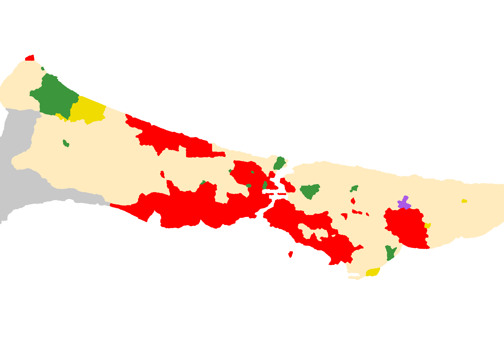

# Av Haritası (iOS)

Konumunuzu Tarım ve Orman Bakanlığı'nın avlak haritası üzerinde gösteren bir iPhone uygulaması. Bulunduğunuz yeri
ve anı **2026-2027 Merkez Av Komisyonu (MAK) kararına** göre değerlendirir: yer, zaman ve tür.
Yasak bir alana girdiğinizde ya da yaklaştığınızda sizi uyarır.

- Alan haritası: **34 İstanbul Avlaklar Haritası 2026-2027**. Bu dosya taranmış bir görüntü
  (`maps/34_istanbul_2026_2027_orijinal.pdf`); koordinatları, aynı şablonla basılmış 2024-2025 GeoPDF'ine
  (`maps/34_istanbul_2024_2025.pdf`) hizalanarak bulundu.
- Kurallar: **2026-2027 Av Dönemi MAK Kararı**, Resmî Gazete 07.06.2026 (`maps/mak_2026_2027.pdf`)

> **Durum:** Kod tamamlandı ancak henüz Xcode'da derlenip iPhone'da denenmedi. İlk derlemede küçük
> düzeltmeler gerekebilir. Veri hattı ve kural mantığı Python ile örnek noktalarda test edildi.



*Kırmızı: ava yasak · yeşil: özel kanunla korunan · sarı: yaban hayvanı yerleştirme sahası · bej: devlet avlağı ·
gri: genel avlak · mor: örnek avlak*

## İstanbul 2026-2027 özeti

| | |
|---|---|
| Av günleri | Çarşamba, Cumartesi, Pazar ve resmi tatiller. Salı: yaban domuzu, 1. ve 3. grup kuşlar |
| Av saati | Gün doğumundan 1 saat önce – gün batımından 1 saat sonra |
| 1. grup kuş (bıldırcın, üveyik) | 18.08 – 15.11.2026 |
| 3. grup kuş (ördekler, çulluk, ardıç, güvercin…) | 24.10.2026 – 07.03.2027 |
| 4. grup kuş (karga, saksağan, karabatak) | 18.08.2026 – 07.03.2027 |
| Tavşan, tilki | 10.10.2026 – 03.01.2027 |
| Yaban domuzu, çakal | 18.08.2026 – 07.03.2027 |
| Keklikler | İstanbul'da **tüm keklik türleri yasak** |
| Ava kapalı avlak | **Sarıkavak Devlet Avlağı** (ayrıca Kocaeli Gebze D.A.) |
| Mesafe yasakları | Yerleşim, mesire, KGM yolu, gölet ve korunan alanlara 300 m; askeri alan, okul, sağlık tesisi, cezaevi ve özel avlaklara 500 m |

Günlük limitler ve tüm ayrıntılar uygulamanın **Bugün** ve **Kurallar** sekmelerinde.

## Ne yapar?

**Harita sekmesi**
- Altlık seçilebilir: Apple Uydu+yol / Uydu / Standart, **OpenTopoMap** (eş yükselti eğrileri, patikalar) ve
  **OpenStreetMap**. OSM ve Topo karoları gezdikçe cihaza kaydedilir; ormanda internet olmadan da görünür.
- Üstünde resmi 2026-27 avlak haritası (opaklığı ayarlanabilir) gösterilir. Haritada küçük kalan veya
  görünmeyen ama kararda geçen alanlar (Adalar, Kızılcaköy-Soğullu YHYS) kesikli çizgiyle eklenir.
- İsteğe bağlı **300 m yasak bantları**: karayolları, köy ve ilçe merkezleri, mesire yerleri.
- Üstteki durum şeridi:
  - 🟥 **Avlanmayın:** yasak alan, korunan alanın 300 m yakını, köy, mesire yeri veya karayoluna 300 m'den
    yakın, kapalı avlak, av günü değil, av saati dışı.
  - 🟧 **Dikkat:** sınıra yakın, örnek avlak, yeri belirsiz yasak alan, asfalt yol, köyün dış evleri olabilir,
    GPS doğruluğu düşük.
  - 🟩 **Avlanabilirsiniz:** devlet veya genel avlak, mesafe kurallarına uygun, bugün av günü ve av saati içinde.

  Şeride dokununca tüm kural kontrolleri tek tek listelenir.
- Haritaya **uzun basınca** o noktanın mekânsal değerlendirmesi görünür (gitmeden önce plan yapmak için).
- **Rüzgâr rozeti ve koku konisi:** sağ altta rüzgâr yönü/hızı; dokununca kokunuzun rüzgârla taşındığı
  alan (rüzgâr altı, 300–1000 m) mor koni olarak çizilir — ava rüzgârı yüzünüze alarak yaklaşın.
- Titreşim, ses ve **arka plan bildirimi** var. Bildirimler yalnızca yer kurallarına göre gelir; örneğin
  Pazartesi günü "av günü değil" bildirimi gelmez.

**Bugün sekmesi:** Seçilen günün av günü olup olmadığı, konuma göre avlanma saati (gün doğumundan 1 saat önce –
gün batımından 1 saat sonra), o gün açık türler ve günlük limitleri, sonraki av günleri, Marmara sezon tarihleri,
limit tablosu. Bugün için ayrıca:
- **Hava ve rüzgâr** (Open-Meteo, anahtarsız): rüzgâr yönü (Türkçe adıyla: Poyraz, Lodos…), hız, hamle,
  sıcaklık, yağış, basınç eğilimi, 12 saatlik rüzgâr şeridi. Son tahmin önbellekte; internetsiz de görünür.
- **Bugünkü avım / av defteri:** her açık tür için +/− sayaç; MAK Tablo-4 limitleri (ördeklerde grup toplamı 6
  ve tür sınırları birlikte) uygulanır, limit dolunca kilitlenir. Kayıtlar yalnızca cihazda.

**Kuş Sesi sekmesi:** 15 sn dinler, önceden eğitilmiş **BirdNET** modeliyle (6.000+ tür) türü tahmin eder ve
MAK EK-1/EK-2 listeleriyle eşleştirip *bugün avlanabilir / sezon dışı / İstanbul'da yasak / koruma altında /
av türü değil* durumunu gösterir. Model kendi sunucunuzda çalışır (`server/birdnet-api`, Hugging Face Spaces
veya ev bilgisayarı; adresi Ayarlar'a yazılır). Sunucu yoksa ya da internet yoksa Apple'ın cihazdaki ses
sınıflandırıcısı yalnızca grup (ördek, kaz, baykuş…) söyler. BirdNET CC BY-NC-SA 4.0 — ticari olmayan kullanım.

**Kilit ekranı / Apple Watch:** Ayarlar'da açılırsa av durumu ve rüzgâr Live Activity olarak kilit ekranında,
Dynamic Island'da ve eşli Apple Watch'un Akıllı Yığın'ında canlı gösterilir (`AvDurumWidget` eklentisi).

**Kurallar sekmesi:** İstanbul için 2026-27 değişiklikleri, mesafe yasakları, avlaklar (açık/kapalı ve içindeki
avlak dışı alanlar), korunan alan listeleri, önemli yasaklar (tüfek, gece görüş, araç, sürek avı…). Her
kuralın yanında madde numarası var.

## Neden bu teknoloji?

| Seçenek | Karar | Gerekçe |
|---|---|---|
| **SwiftUI + MapKit** | ✅ Kullanıldı | Ek bağımlılık ve API anahtarı yok, ücretsiz. Arka planda konum ve bildirim en güvenilir şekilde native çalışıyor. Özel karo katmanı ve çokgen çizimi destekleniyor. |
| OpenStreetMap / OpenTopoMap | ✅ Altlık olarak | Arazi için en faydalı altlık (patika, eş yükselti). MapKit üzerine karo katmanı olarak eklendi. Görüntülenen karolar önbelleğe alınıyor; toplu indirme yapılmıyor (OSM kullanım politikası). |
| Apple Uydu | ✅ Altlık olarak | Orman ve tarla sınırlarını görmek için. |
| Google Maps SDK | ❌ | API anahtarı ve faturalandırma gerektiriyor. Karoların çevrimdışı saklanmasına lisans izin vermiyor. |
| Mapbox / MapLibre Native | Sonra | Vektör tabanlı çevrimdışı haritalar için en iyi seçenek, ama stil ve karo barındırma gerektiriyor. Tam çevrimdışı bölge paketi gerekirse geçiş yolu bu. |
| Flutter / React Native | Sonra | Android sürümü istenirse düşünülebilir (Flutter + flutter_map + OSM). Bugün iOS'ta native en sağlam yol. |

## Veri hattı

```
maps/34_istanbul_2026_2027_orijinal.pdf  (taranmış JPEG, koordinatsız)
  └─ tools/georef_scan.py (2024-25 GeoPDF'ine OpenCV ECC ile hizalama, korelasyon 0,998)
       → maps/34_istanbul_2026_2027.pdf (GeoPDF)
       └─ tools/generate_assets.py --scan → istanbul_2026_2027.zones.bin / .tiles / .json
maps/34_istanbul_2024_2025.pdf  (vektörlü GeoPDF, WGS84)
  └─ tools/extract_features.py → *.features.json (köy/ilçe/mesire, karayolu/asfalt), *.units.bin (avlak birimleri)
maps/mak_2026_2027.pdf  (463 sayfa, taranmış)
  ├─ tools/ocr_pdf.py → docs/mak_2026_2027_ocr.txt
  └─ elle yapılandırıldı → ios/AvHaritasi/MapData/mak_2026_2027.json
```

`maps/34_istanbul_2026_2027.pdf` yeniden üretilebildiği için depoda tutulmuyor (`.gitignore`); yukarıdaki komutla
oluşturulur. Belgenin nasıl bölümlendiği ve okunduğu `docs/MAK_2026_2027_okuma.md` dosyasında anlatılıyor.

## Kurulum (Mac + Xcode 16+)

1. `ios/AvHaritasi.xcodeproj` dosyasını açın.
2. *AvHaritasi* hedefi → **Signing & Capabilities** → **Team** olarak Apple kimliğinizi seçin. Gerekirse
   Bundle Identifier'ı benzersiz yapın.
3. iPhone'u bağlayın ve ▶︎ ile çalıştırın. İlk seferde *Ayarlar → Genel → VPN ve Aygıt Yönetimi*'nden
   geliştiriciye güvenin ve *Gizlilik ve Güvenlik → Geliştirici Modu*'nu açın.
4. Konum izni: "Uygulamayı Kullanırken". Arka plan uyarısı için Ayarlar'dan *Arka planda takip*'i açın.

Ücretsiz Apple ID ile yüklenen uygulama 7 günde bir yeniden yüklenmelidir.

## Yeni sezon / başka il

```bash
pip install pymupdf numpy scipy pillow scikit-image opencv-python-headless
# Taranmış haritayı koordinatlandır (aynı şablonla basılmış bir GeoPDF referans olarak gerekir)
python3 tools/georef_scan.py maps/34_istanbul_2024_2025.pdf maps/34_istanbul_2026_2027_orijinal.pdf \
    maps/34_istanbul_2026_2027.pdf --check docs/hizalama.png
python3 tools/generate_assets.py maps/34_istanbul_2026_2027.pdf --scan --name istanbul_2026_2027 \
    --title "İstanbul Avlaklar Haritası" --season "2026-2027" --out ios/AvHaritasi/MapData \
    --preview docs/siniflandirma_onizleme.png
# Vektörlü GeoPDF varsa --scan olmadan doğrudan; köy/yol vektörleri için:
python3 tools/extract_features.py maps/34_istanbul_2024_2025.pdf --name istanbul_2024_2025 --out ios/AvHaritasi/MapData
```

Yeni MAK kararı geldiğinde `mak_2026_2027.json` güncellenir: gruplar, tarihler, limitler, tatiller, değişiklikler.
`overrides` alanına yalnızca haritada görünmeyen ya da çok küçük kalan yasak alanlar eklenir (şu an Adalar ve
Kızılcaköy-Soğullu YHYS). Dosya adı değişirse `AppModel.swift` içindeki kaynak adlarını da güncelleyin.

## ⚠️ Sınırlamalar

- **Uygulama resmi değildir.** Yasal sorumluluk avcıya aittir.
- 2026-27 haritası taranmış bir görüntü. Alanlar renkten okunuyor ve yazı ile çizgiler süzülüyor; çok küçük
  alanlar (birkaç yüz metre) kaybolabilir. Adalar bu yüzden ayrıca işaretlendi. Kızılcaköy-Soğullu YHYS
  haritada görünmediği için geniş bir "dikkat" alanı olarak eklendi.
- Köy/yol vektörleri ve avlak birim adları 2024-25 haritasından geliyor. 2026-27'de birim adları değişmiş
  olabilir (ör. Kocaeli Ovacık D.A.).
- Harita 1:490.000 ölçekli; sınırlar birkaç yüz metre sapabilir.
- Köy mesafesi köy merkezi noktasından hesaplanıyor. Köyün en dış evleri için kendi gözleminizi esas alın.
- Yol sınıfı haritadan alındı: Karayolu ve Ekspres yol KGM yolu kabul edildi, asfalt yollar "dikkat".
- 500 m kuralındaki askeri alan, okul, sağlık tesisi, cezaevi gibi yerler için veri yok.
- Av günü: resmi tatiller listede var. Sonradan ilan edilecek idari tatilleri kendiniz kontrol edin.
- Yeşil durum; avcılık belgesi, avlanma izin kartı, AVBİS izni ve kota yükümlülüklerini kaldırmaz.

## Dosya yapısı

```
ios/AvHaritasi/
  AvHaritasiApp.swift
  Model/
    HuntingMap.swift       Bölge ızgarası (renk sınıfları), en yakın bölge araması
    MapFeatures.swift      Köy/ilçe/mesire noktaları, yollar, avlak birimleri
    Regulations.swift      MAK kuralları: sezon, gün, saat, tür, limit, değişiklikler
    Assessment.swift       Yer + zaman kural motoru
    Geo.swift, Sun.swift   Geometri, gün doğumu/batımı
    TilePack.swift         Resmi harita karo paketi
    BaseLayers.swift       Apple / OpenTopoMap / OSM altlıkları ve önbellek
    Weather.swift          Open-Meteo tahmini, pusula, koku konisi
    HarvestLog.swift       Av defteri ve günlük limit sayacı
    BirdID.swift           Kayıt, BirdNET istemcisi, cihazda yedek, MAK tür eşlemesi
    LiveStatus.swift       Live Activity güncellemesi
    AppModel.swift         Konum, değerlendirme, uyarılar
  Views/                   Harita, Bugün, Kurallar, Kuş Sesi, Ayarlar, Lejant
ios/AvDurumWidget/         Kilit ekranı / Dynamic Island Live Activity eklentisi
ios/Shared/                Uygulama ve eklentinin ortak tipleri
server/birdnet-api/        BirdNET FastAPI sunucusu (Docker / HF Spaces)
  MapData/                 Üretilmiş veriler
tools/                     PDF → veri araçları
docs/                      Okuma stratejisi, OCR metni, önizleme
maps/                      Kaynak PDF'ler
```
